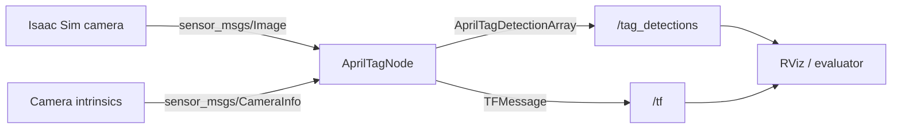
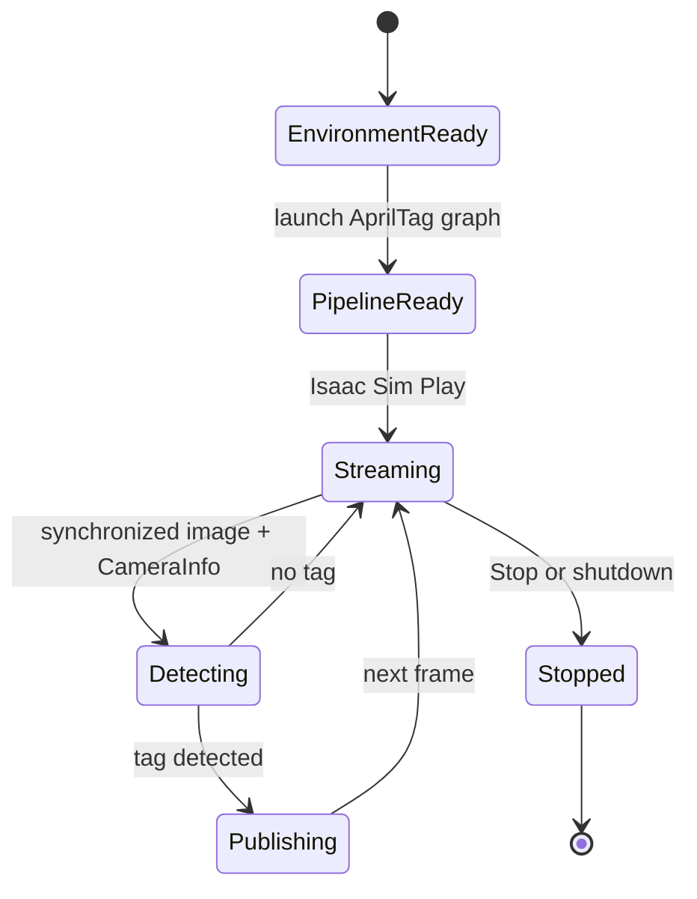
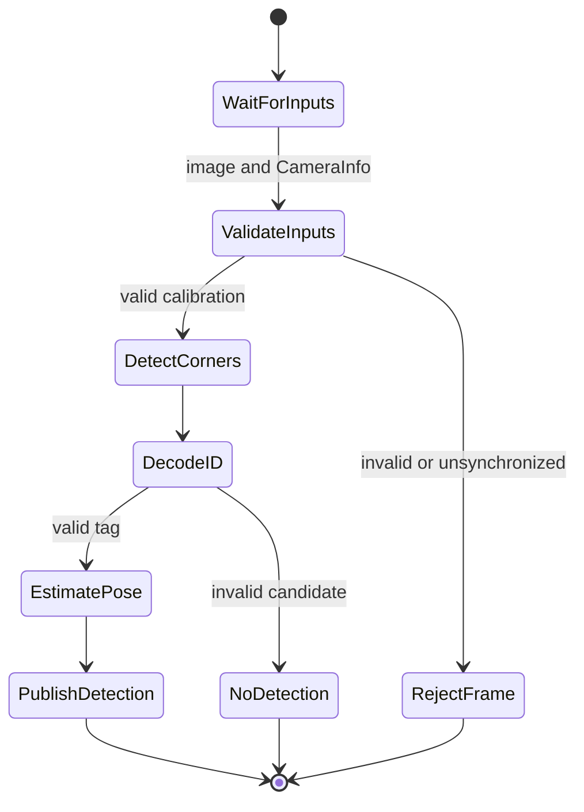

# Isaac ROS AprilTag Example with Isaac Sim

Isaac Sim 카메라 영상으로 AprilTag를 검출하고, Isaac ROS에서 각 태그의 ID와 6-DoF 자세를 추정하는 기본 예제입니다. 이 저장소는 NVIDIA의 [AprilTag Detection with Isaac Sim 튜토리얼](https://nvidia-isaac-ros.github.io/concepts/fiducials/apriltag/tutorial_isaac_sim.html)을 바탕으로 실행 절차, ROS 2 그래프, 상태 흐름, 성능평가 방법을 한곳에 정리합니다.

> 기준 문서: Isaac ROS 4.5 / ROS 2 Jazzy 문서(2026-07-08 갱신). 실제 설치 버전에 따라 launch 인자와 패키지 버전이 달라질 수 있습니다.

## 1. 시나리오 개요

1. Isaac Sim에 카메라와 AprilTag가 포함된 장면을 엽니다.
2. Isaac Sim의 ROS 2 Bridge가 보정된 RGB 영상과 카메라 내부 파라미터를 ROS 2 토픽으로 발행합니다.
3. `isaac_ros_apriltag`의 GPU 가속 `AprilTagNode`가 영상에서 태그를 검출합니다.
4. 노드는 태그 ID, 네 모서리 좌표, 중심점 및 카메라 기준 6-DoF pose를 계산합니다.
5. 결과를 `/tag_detections`와 `/tf`로 발행하며 RViz 또는 터미널에서 확인합니다.

카메라 내부 파라미터가 올바르지 않으면 2D 검출은 가능해도 신뢰할 수 있는 3D pose를 얻을 수 없습니다. `size` 파라미터도 시뮬레이션 속 AprilTag 실제 한 변 길이와 일치해야 합니다.

## 2. 사전 준비

- NVIDIA GPU가 있는 Ubuntu/Jetson 환경
- Isaac ROS 개발 환경 및 Isaac Sim
- ROS 2 Jazzy
- `isaac_ros_apriltag` 패키지
- RViz2(선택)

바이너리 패키지를 사용하는 경우:

```bash
isaac-ros activate
sudo apt-get update
sudo apt-get install -y ros-jazzy-isaac-ros-apriltag
```

소스 빌드는 [NVIDIA Isaac ROS AprilTag 공식 문서](https://nvidia-isaac-ros.github.io/repositories_and_packages/isaac_ros_apriltag/isaac_ros_apriltag/index.html)를 참고하십시오.

## 3. 실행 방법

### Terminal 1 — AprilTag 파이프라인

```bash
isaac-ros activate
ros2 launch isaac_ros_apriltag isaac_ros_apriltag_isaac_sim_pipeline.launch.py
```

### Isaac Sim

공식 Isaac ROS Isaac Sim Setup Guide에 따라 Isaac Sim을 실행하고 AprilTag 예제 stage를 연 뒤 **Play**를 누릅니다. Play 이후 카메라의 `image`와 `camera_info` 스트림이 ROS 2로 전달됩니다.

### Terminal 2 — RViz 시각화

```bash
sudo apt-get install -y ros-jazzy-rviz2
source /opt/ros/jazzy/setup.bash
rviz2 -d $(ros2 pkg prefix isaac_ros_apriltag --share)/rviz/default.rviz
```

### Terminal 3 — 결과 메시지 확인

```bash
ros2 topic echo /tag_detections
```

추가 확인 명령:

```bash
ros2 node list
ros2 topic list
ros2 topic info /tag_detections --verbose
ros2 topic hz /tag_detections
ros2 topic bw /tag_detections
ros2 run tf2_ros tf2_echo <camera_frame> tag36h11:<tag_id>
```

## 4. 호출되는 주요 라이브러리와 패키지

| 계층 | 패키지/라이브러리 | 역할 |
|---|---|---|
| 시뮬레이션 | Isaac Sim, ROS 2 Bridge | 가상 카메라 렌더링 및 ROS 2 영상·CameraInfo 발행 |
| 검출 | `isaac_ros_apriltag` | AprilTag 검출과 pose 추정 기능 제공 |
| 가속 실행 | `isaac_ros_nitros`, `isaac_ros_gxf` | NITROS 타입 협상과 GPU 친화적 데이터 전달/그래프 실행 |
| 인터페이스 | `isaac_ros_apriltag_interfaces` | `AprilTagDetection`, `AprilTagDetectionArray` 메시지 정의 |
| 표준 메시지 | `sensor_msgs` | 입력 `Image`, `CameraInfo` 메시지 |
| 좌표계 | `tf2_ros`, `tf2_msgs` | 카메라와 검출 태그 사이 transform 발행 |
| 실행 기반 | `rclcpp`, `rclcpp_components` | ROS 2 컴포저블 노드와 executor |
| 시각화 | `rviz2` | 영상, TF 및 태그 pose 시각화 |

실제 동적 라이브러리 목록은 설치 버전에 따라 달라질 수 있으므로 다음 명령으로 확인하는 것이 가장 정확합니다.

```bash
ros2 pkg executables isaac_ros_apriltag
ros2 pkg xml isaac_ros_apriltag
ros2 component types | grep -i apriltag
```

## 5. ROS 2 노드와 토픽

핵심 컴포넌트 플러그인은 `nvidia::isaac_ros::apriltag::AprilTagNode`입니다.

| 노드/구성요소 | 구분 | 입력 | 출력 | 역할 |
|---|---|---|---|---|
| Isaac Sim Camera + ROS 2 Bridge | 시뮬레이터 측 publisher | 가상 scene | `image`, `camera_info` | RGB 영상과 카메라 보정정보 제공 |
| `AprilTagNode` | Isaac ROS composable node | `image`, `camera_info` | `tag_detections`, `tf` | 태그 검출, ID 판독, 6-DoF pose 추정 |
| RViz2 | visualization node | 영상, `tag_detections`, `tf` | 화면 | 결과 시각화 |
| `ros2 topic echo` | CLI subscriber | `tag_detections` | 터미널 | 원시 검출 메시지 확인 |

> launch 파일이 remapping이나 내부 컨테이너 이름을 적용할 수 있으므로, 실행 후 `ros2 node list`와 `ros2 node info <node_name>`으로 실제 이름을 확인하십시오.

### 데이터 흐름



## 6. 주요 파라미터

| 파라미터 | 기본값 | 설명 |
|---|---:|---|
| `size` | `0.22` | 정사각형 태그 한 변 길이(m). pose scale 정확도에 직접 영향 |
| `max_tags` | `64` | 프레임당 최대 검출 태그 수 |
| `tile_size` | `4` | adaptive thresholding 타일/윈도 크기(pixel) |
| `tag_family` | `tag36h11` | 검출할 태그 family. CUDA backend는 공식 문서상 `tag36h11`만 지원 |
| `backends` | `CUDA` | 검출 backend: `CPU`, `CUDA`, `PVA` |

## 7. 상태 다이어그램

### 전체 시나리오 상태



### 프레임별 검출 상태



## 8. 성능 분석에서 제시할 결과

단순 실행 화면보다 아래 결과를 함께 제시하면 실험 보고서나 논문의 재현성과 분석 가치가 높아집니다.

| 평가축 | 권장 지표 | 계산/측정 방법 |
|---|---|---|
| 처리속도 | FPS, inter-frame time | 입력 영상 timestamp와 출력 검출률 또는 Isaac ROS Benchmark |
| 지연시간 | 평균, median, P95/P99 latency(ms) | 입력 acquisition timestamp부터 `tag_detections` 수신까지 |
| 검출성능 | precision, recall, F1, detection rate | Isaac Sim ground-truth 태그 visibility/ID와 검출 결과 매칭 |
| 위치정확도 | translation RMSE/MAE(cm) | 추정 ((x,y,z))와 simulator ground truth 비교 |
| 자세정확도 | rotation error(deg) | `acos((trace(R_gt^T R_est)-1)/2)` |
| 안정성 | pose jitter, dropout rate | 정지 태그에서 위치·각도 표준편차와 연속 미검출 비율 |
| 자원사용량 | GPU/CPU utilization, GPU memory, power | `nvidia-smi`, Jetson의 `tegrastats` 또는 `jtop` |
| 확장성 | FPS/latency vs. tag count | 1, 4, 16, 32, 64개 태그 조건 비교 |
| 강건성 | 성능 vs. 거리·각도·조도·blur | 조건별 detection rate와 pose error curve |
| backend 비교 | CUDA vs CPU vs PVA | 동일 입력과 설정에서 속도·정확도·전력 비교 |

### 권장 실험 설계

- 거리: 예) 0.5, 1, 2, 3, 5 m
- 시야각: 예) 0°, 15°, 30°, 45°, 60°
- 해상도와 프레임률: 720p/1080p, 15/30/60 FPS
- 태그 크기와 개수: 실제 크기별, 1개부터 `max_tags` 근처까지
- 영상 열화: 조도, motion blur, 부분 가림, sensor noise
- backend: CPU/CUDA/PVA(지원 하드웨어에서)
- 각 조건을 여러 seed와 충분한 프레임으로 반복하고 평균뿐 아니라 95% 신뢰구간을 제시

### 핵심 오차식

Translation error:

```text
e_t = || t_est - t_gt ||_2
```

Rotation error:

```text
e_R = acos( clamp((trace(R_gt^T R_est) - 1) / 2, -1, 1) )
```

End-to-end latency:

```text
L_e2e = t_detection_received - t_image_acquired
```

정확도 비교 시에는 Isaac Sim의 world-frame ground truth를 카메라 frame으로 변환하고, ROS optical frame 축 정의까지 일치시킨 후 오차를 계산해야 합니다.

## 9. 추천 결과 그림과 표

1. 거리별 translation RMSE와 rotation error 선그래프
2. 시야각별 detection rate 그래프
3. CUDA/CPU/PVA별 FPS–latency–power 비교표
4. 태그 개수 증가에 따른 throughput/latency 그래프
5. 정지 태그 pose time-series 및 jitter boxplot
6. 원본 영상, 검출 corner/ID, TF pose, ground truth overlay 예시

## 10. 주의사항

- `camera_info`가 영상과 같은 카메라 및 frame을 나타내는지 확인합니다.
- `size`가 실제 simulated tag 크기와 다르면 깊이/translation scale에 체계적 오차가 생깁니다.
- CUDA backend에서는 `tag36h11` 제약을 먼저 확인합니다.
- Isaac Sim의 simulation time 사용 여부와 ROS 2 노드의 `use_sim_time` 설정을 일치시킵니다.
- 성능 측정 시 첫 구간은 CUDA warm-up으로 제외하고, 동일 QoS·해상도·프레임률을 유지합니다.
- 렌더링 FPS와 ROS publication FPS가 다를 수 있으므로 둘을 별도로 기록합니다.

## References

- [NVIDIA: Tutorial for AprilTag Detection with Isaac Sim](https://nvidia-isaac-ros.github.io/concepts/fiducials/apriltag/tutorial_isaac_sim.html)
- [NVIDIA: isaac_ros_apriltag package and API](https://nvidia-isaac-ros.github.io/repositories_and_packages/isaac_ros_apriltag/isaac_ros_apriltag/index.html)
- [NVIDIA-ISAAC-ROS/isaac_ros_apriltag](https://github.com/NVIDIA-ISAAC-ROS/isaac_ros_apriltag)
