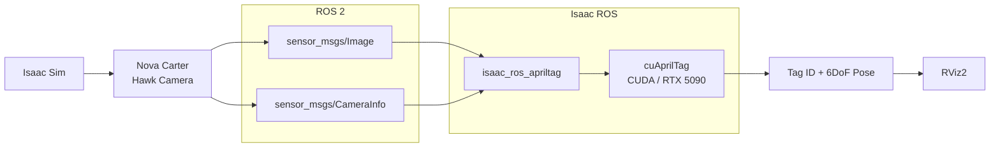
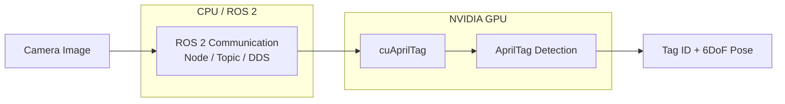
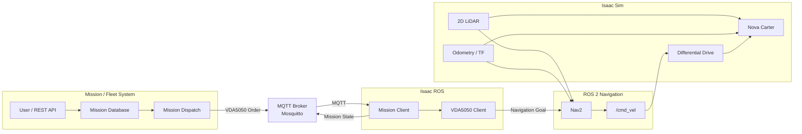
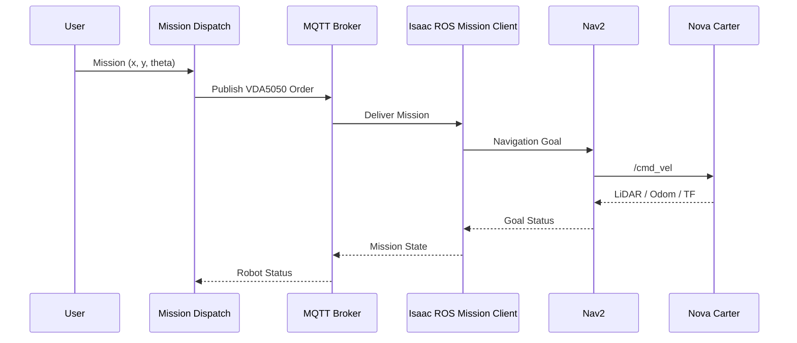
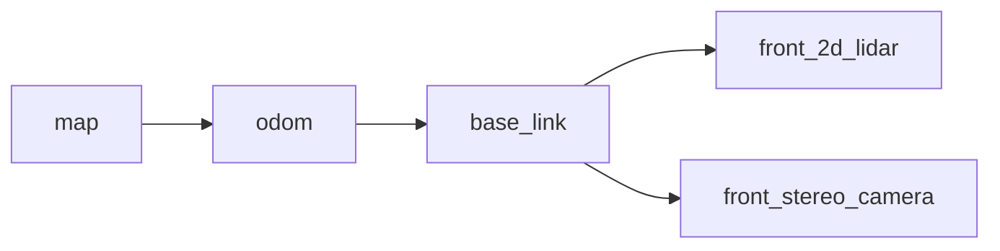
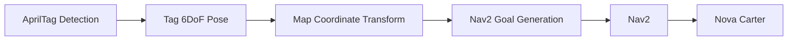

# Isaac ROS AprilTag and Mission Client on RTX 5090
## GPU-Accelerated AprilTag Perception & Mission Client Navigation in Isaac Sim

이 저장소는 **NVIDIA Isaac ROS**의 서로 다른 두 기능 영역을 직접 실행하고 검증한 기록이다.

- **Example 1 — AprilTag Perception:** Isaac Sim 카메라 → ROS 2 → Isaac ROS AprilTag → `cuAprilTag` → Tag ID / 6DoF Pose
- **Example 2 — Mission Client:** Mission Dispatch → MQTT / VDA5050 → Isaac ROS Mission Client → Nav2 → Nova Carter
- **Performance Evaluation:** AprilTag Node benchmark를 loaded workstation 상태와 clean 상태에서 비교

---

## 1. Project Architecture

```mermaid
flowchart TB

    subgraph SIM["Isaac Sim 6.0.1"]
        CARTER["Nova Carter"]
        CAMERA["Hawk Stereo Camera"]
        LIDAR["2D LiDAR"]
        DRIVE["Differential Drive"]

        CARTER --> CAMERA
        CARTER --> LIDAR
        DRIVE --> CARTER
    end

    subgraph ROS["ROS 2 Jazzy"]
        IMAGE["Image / CameraInfo"]
        SENSOR["LaserScan / Odom / TF"]
        CMD["/cmd_vel"]
    end

    subgraph ISAAC["NVIDIA Isaac ROS 4.5"]
        subgraph PERCEPTION["Example 1 · GPU Perception"]
            APRIL["isaac_ros_apriltag"]
            CUDA["cuAprilTag / CUDA"]
            POSE["Tag ID + 6DoF Pose"]
            APRIL --> CUDA --> POSE
        end

        subgraph CONTROL["Example 2 · Mission Control"]
            CLIENT["Isaac ROS Mission Client"]
            VDA["VDA5050 Client"]
            NAV["Nav2"]
            CLIENT --> VDA --> NAV
end
    end

    CAMERA --> IMAGE --> APRIL
    POSE --> RVIZ["RViz2"]

    LIDAR --> SENSOR --> NAV
    NAV --> CMD --> DRIVE

    DISPATCH["Mission Dispatch"]
    MQTT["MQTT Broker / Mosquitto"]

    DISPATCH -->|"VDA5050 Order"| MQTT
    MQTT -->|"Mission"| CLIENT
    CLIENT -->|"Mission State"| MQTT
```



| 예제 | Isaac ROS에서의 역할 | 입력 | 주요 결과 |
|---|---|---|---|
| AprilTag | GPU-accelerated perception | Camera Image / CameraInfo | Tag ID + 6DoF Pose |
| Mission Client | External mission ↔ ROS 2 integration | Mission / waypoint | Nav2 기반 Nova Carter 이동 |

---

# 2. Example 1 — Isaac ROS AprilTag

## 2.1 목적

Isaac Sim의 Nova Carter 카메라 영상을 ROS 2로 전달하고,
Isaac ROS의 AprilTag Node가 NVIDIA CUDA 기반 `cuAprilTag`를 사용해 태그를 검출하는 파이프라인을 확인했다.

> 이 예제의 목적은 태그를 따라 로봇을 주행시키는 것이 아니라 **Perception 결과인 Tag ID와 Pose를 얻는 것**이다.

## 2.2 Perception Pipeline



## 2.3 Isaac Sim Environment


**Figure 1.** Nova Carter와 AprilTag가 배치된 Isaac Sim warehouse 환경.

## 2.4 CUDA Runtime Verification


핵심 실행 로그:

```text
[apriltag]: Using cuAprilTag implementation.
```

이는 Isaac ROS의 NVIDIA `cuAprilTag` 구현이 실제로 로드되었음을 보여준다.

## 2.5 RViz Detection Result


**Figure 2.** 카메라 영상과 Tag/TF 결과를 RViz에서 확인한 모습.

## 2.6 CPU / GPU Role



핵심은 **ROS 2 자체가 GPU로 대체되는 것이 아니라**, GPU에 적합한 perception 연산을 NVIDIA CUDA 기반 구현으로 가속한다는 점이다.

---

# 3. Example 2 — Isaac ROS Mission Client

## 3.1 목적

두 번째 예제에서는 AprilTag를 이동 목표로 사용하지 않았다.

외부 Mission System에서 지정한 `(x, y, theta)` 좌표를 Mission Client가 받아 Nav2에 전달하고,
Nav2가 Nova Carter를 해당 목표로 이동시키는 구조를 확인했다.

## 3.2 Mission Client Architecture



## 3.3 Mission Dispatch API


**Figure 3.** Mission Dispatch의 Swagger UI. Robot 및 Mission REST endpoint를 확인할 수 있다.

## 3.4 Mission Execution Sequence



## 3.5 Mission Execution Result


**Figure 4.** Mission 실행 전/후의 Nova Carter 상태를 녹화 영상에서 추출한 대표 프레임.


**Figure 5.** Mission 실행 과정에서의 RViz/TF 시각화 대표 프레임.

전체 실행 녹화:

[mission_execution_demo.webm](https://github.com/user-attachments/assets/b7535387-12b8-4b49-8a6b-73bb93a911ad)

---

# 4. AprilTag Performance Evaluation

## 4.1 Benchmark 목적

기능 동작 여부와 성능 측정은 분리해서 확인했다.

- **Function test:** Isaac Sim + RViz + AprilTag / Mission Client가 실제로 동작하는가?
- **Node benchmark:** 다른 GPU workload를 제거했을 때 AprilTag Node가 어느 정도 throughput을 내는가?

처음에는 Isaac Sim 등 다른 workload가 동작 중인 상태에서 benchmark를 실행했다.
이후 background GPU workload를 종료하고 동일한 benchmark를 clean 상태에서 다시 수행했다.

## 4.2 Loaded vs Clean Benchmark


| Metric | Loaded workstation | Clean benchmark |
|---|---:|---:|
| Mean Frame Rate | 264.922 FPS | **433.187 FPS** |
| Mean Playback Rate | 268.331 FPS | **443.390 FPS** |
| Peak Throughput Prediction | 268.125 Hz | **443.281 Hz** |
| Idle GPU Utilization | 38.0% | **0.0%** |
| Idle System CPU Utilization | 9.208% | **0.344%** |

Clean benchmark의 Mean Frame Rate는 loaded workstation 대비 약 **63.5% 증가**했다.

## 4.3 Real-time Input Tracking


| Input | Measured Output | Missed Frames | First Latency | Last Latency |
|---:|---:|---:|---:|---:|
| 10 FPS | 10.205 FPS | 0 | 2.333 ms | 1.977 ms |
| 30 FPS | 30.204 FPS | 0 | 1.774 ms | 1.451 ms |
| 60 FPS | 60.204 FPS | 0 | 1.700 ms | 1.677 ms |

10 / 30 / 60 FPS 조건에서는 모두 **Missed Frames = 0**을 기록했다.

## 4.4 Clean Benchmark Final Result

```text
Resolution                  : HD (1280 x 720)
Mean Playback Frame Rate    : 443.390 FPS
Mean Frame Rate             : 433.187 FPS
Peak Throughput Prediction  : 443.281 Hz
Idle GPU Utilization        : 0.000 %
```

Benchmark report에서는 실제 test가 정상 완료되었다.

```text
Ran 1 test
OK
```

종료 후 `component_container_mt`가 SIGTERM/SIGKILL로 정리되는 메시지가 추가로 나타났지만,
이는 **Final Report와 report export 이후의 container 종료 단계**이다.

Raw benchmark logs:

- [Loaded workstation benchmark log](results/apriltag_benchmark_loaded_workstation.txt)
- [Clean benchmark log](results/apriltag_benchmark_clean.txt)
- [Benchmark summary JSON](results/benchmark_summary.json)
- [Benchmark summary CSV](results/benchmark_summary.csv)

---

# 5. What I Learned

## Isaac ROS와 ROS 2

```text
ROS 2
= Node / Topic / Service / Action / DDS

Isaac ROS
= ROS 2 위에서 동작하는 NVIDIA-optimized robotics packages
```

Isaac ROS는 ROS 2를 대체하지 않는다.
대신 perception, AI, sensor processing 등 GPU에 적합한 부분을 NVIDIA 플랫폼에 맞게 최적화한다.

## Isaac Sim과 Isaac ROS

```text
Isaac Sim
= Robot / Sensor / Physics Simulation

Isaac ROS
= Sensor Processing / Robotics Algorithms / Integration
```

## 두 예제의 차이

```text
AprilTag
Camera → GPU Perception → Detection / Pose

Mission Client
External Mission → MQTT / VDA5050 → Nav2 → Robot Action
```

---

# 6. Troubleshooting Notes

## AprilTag Image가 RViz에 나오지 않을 때

```bash
ros2 topic info -v /front_stereo_camera/left/image_rect_color
```

`Publisher count: 0`이면 RViz QoS보다 먼저 Isaac Sim의 camera render product 및 ROS Camera Publisher 상태를 확인한다.

## Mission Client에서 map TF 오류가 발생할 때



`Timed out waiting for transform from base_link to map` 오류가 나타나면 localization, odometry, TF, LiDAR 입력 상태를 확인한다.

---

# 7. Repository Structure

```text
.
├── isaac_ros_RTX5090_AprilTag_n_MissionClient.md
├── isaac_ros_RTX5090_AprilTag_n_MissionClient_EN.md
├── assets/
│   ├── apriltag_sim_scene.png
│   ├── apriltag_rviz_detection.png
│   ├── apriltag_cuda_runtime.png
│   ├── mission_dispatch_api.png
│   ├── mission_before_after.png
│   ├── mission_rviz_execution_frame.png
│   ├── mission_execution_demo.webm
│   ├── rviz_execution_demo.webm
│   ├── benchmark_loaded_vs_clean.png
│   └── benchmark_realtime_fps.png
└── results/
    ├── apriltag_benchmark_loaded_workstation.txt
    ├── apriltag_benchmark_clean.txt
    ├── benchmark_summary.json
    └── benchmark_summary.csv
```

---

# 8. Future Work



특정 AprilTag를 발견하면 Tag의 pose를 기준으로 **Tag 앞 특정 거리까지 자동 이동하는 기능**으로 확장할 수 있다.

---

# 9. Summary

**GPU Perception**

```text
Camera → Isaac ROS AprilTag → cuAprilTag → Tag ID / 6DoF Pose
```

**Mission / Robot Integration**

```text
Mission Dispatch → MQTT / VDA5050 → Isaac ROS Mission Client → Nav2 → Nova Carter
```

그리고 AprilTag benchmark를 통해,
동일한 하드웨어에서도 background workload 유무에 따라 측정 결과가 크게 달라질 수 있음을 확인했다.
