# Isaac ROS AprilTag and Mission on RTX 5090
## GPU-Accelerated AprilTag Perception & Mission Client Navigation in Isaac Sim

This document records the hands-on implementation and validation of two different functional areas of **NVIDIA Isaac ROS**.

- **Example 1 — AprilTag Perception:** Isaac Sim Camera → ROS 2 → Isaac ROS AprilTag → `cuAprilTag` → Tag ID / 6DoF Pose
- **Example 2 — Mission Client:** Mission Dispatch → MQTT / VDA5050 → Isaac ROS Mission Client → Nav2 → Nova Carter
- **Performance Evaluation:** Comparison of the AprilTag Node benchmark under a loaded workstation condition and a clean benchmark condition

---

## 1. Project Architecture

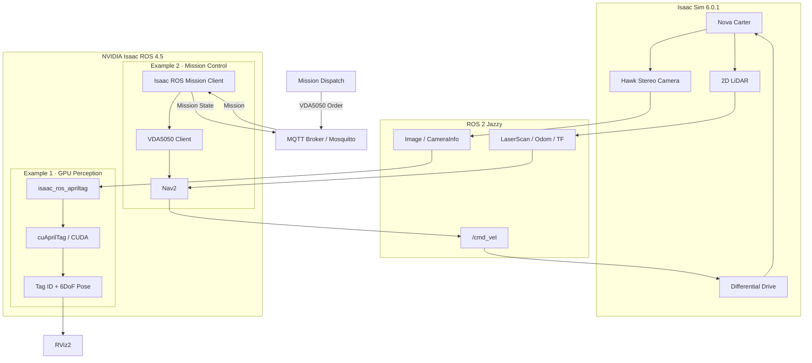

| Example | Role in Isaac ROS | Input | Main Result |
|---|---|---|---|
| AprilTag | GPU-accelerated perception | Camera Image / CameraInfo | Tag ID + 6DoF Pose |
| Mission Client | External mission ↔ ROS 2 integration | Mission / waypoint | Nav2-based Nova Carter navigation |

---

# 2. Example 1 — Isaac ROS AprilTag

## 2.1 Objective

The Nova Carter camera stream in Isaac Sim was published through ROS 2 and processed by the Isaac ROS AprilTag Node using NVIDIA CUDA-based `cuAprilTag`.

The purpose of this example was to validate the perception pipeline.

> The goal of this example is **not to make the robot navigate toward an AprilTag**, but to obtain perception results such as the **Tag ID and Pose**.

## 2.2 Perception Pipeline

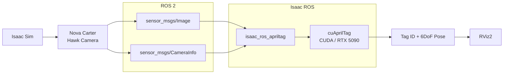

## 2.3 Isaac Sim Environment

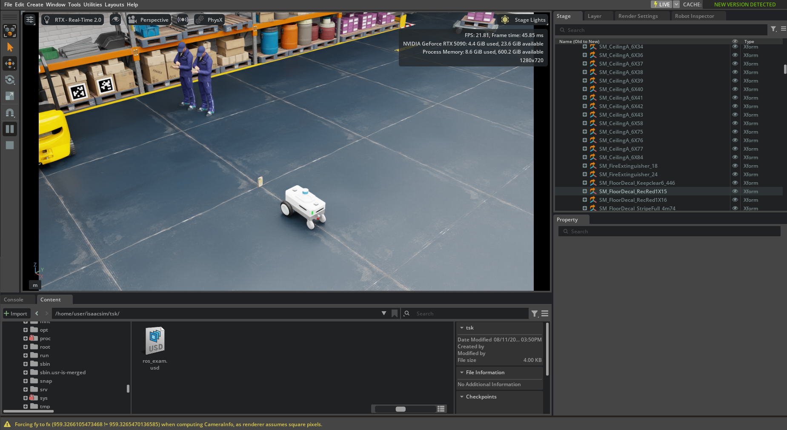

**Figure 1.** Isaac Sim warehouse environment with Nova Carter and AprilTag markers.

## 2.4 CUDA Runtime Verification

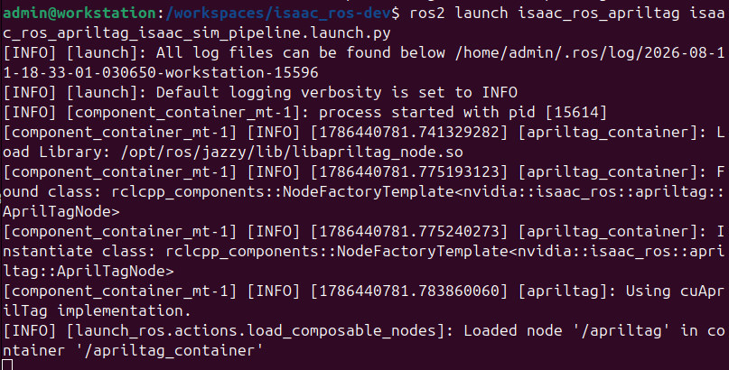

Key runtime log:

```text
[apriltag]: Using cuAprilTag implementation.
```

This confirms that the NVIDIA `cuAprilTag` implementation used by Isaac ROS was actually loaded.

## 2.5 RViz Detection Result

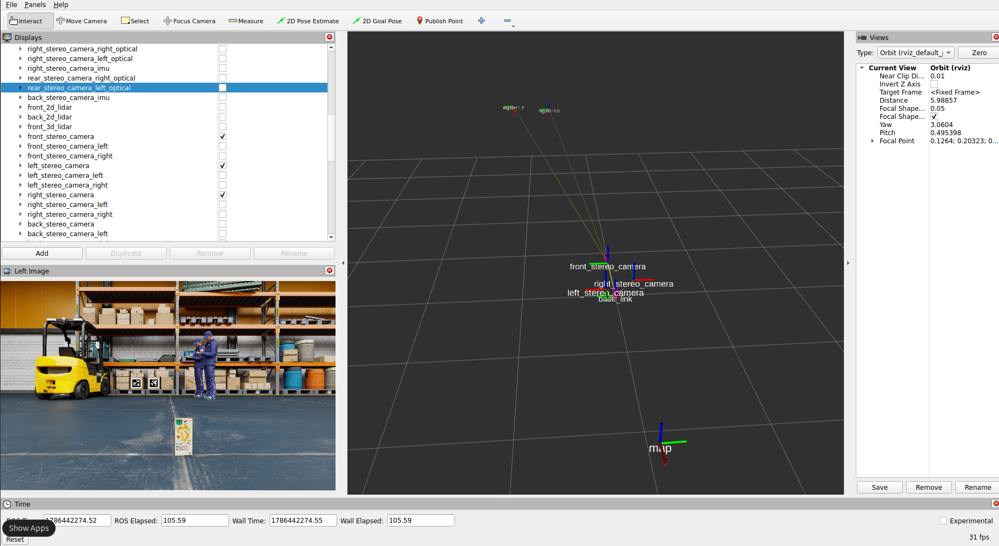

**Figure 2.** Camera image and AprilTag/TF results visualized in RViz.

## 2.6 CPU / GPU Roles

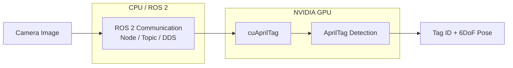

The key point is that **ROS 2 itself is not replaced by the GPU**. Instead, GPU-suitable perception workloads are accelerated using NVIDIA CUDA-based implementations.

---

# 3. Example 2 — Isaac ROS Mission Client

## 3.1 Objective

In the second example, AprilTag was not used as the navigation target.

The Mission Client received target coordinates `(x, y, theta)` defined by an external Mission System and forwarded them to Nav2. Nav2 then navigated Nova Carter toward the specified goal.

## 3.2 Mission Client Architecture

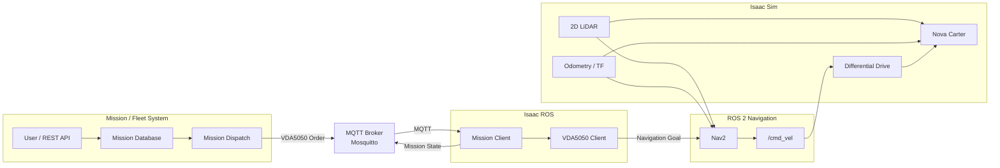

## 3.3 Mission Dispatch API

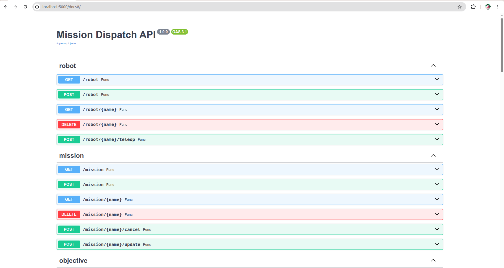

**Figure 3.** Mission Dispatch Swagger UI showing the Robot and Mission REST endpoints.

## 3.4 Mission Execution Sequence

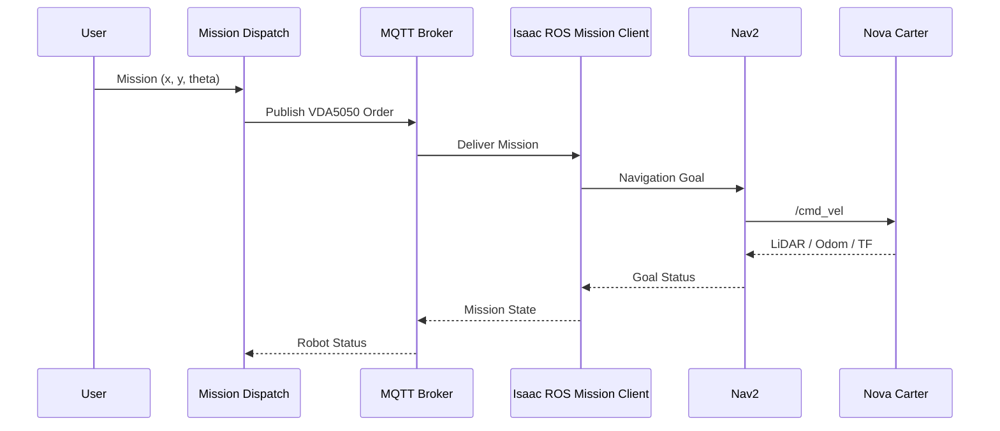

## 3.5 Mission Execution Result

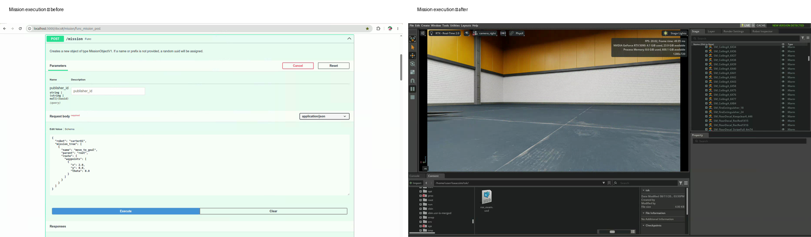

**Figure 4.** Representative frames extracted from the recording before and after mission execution.

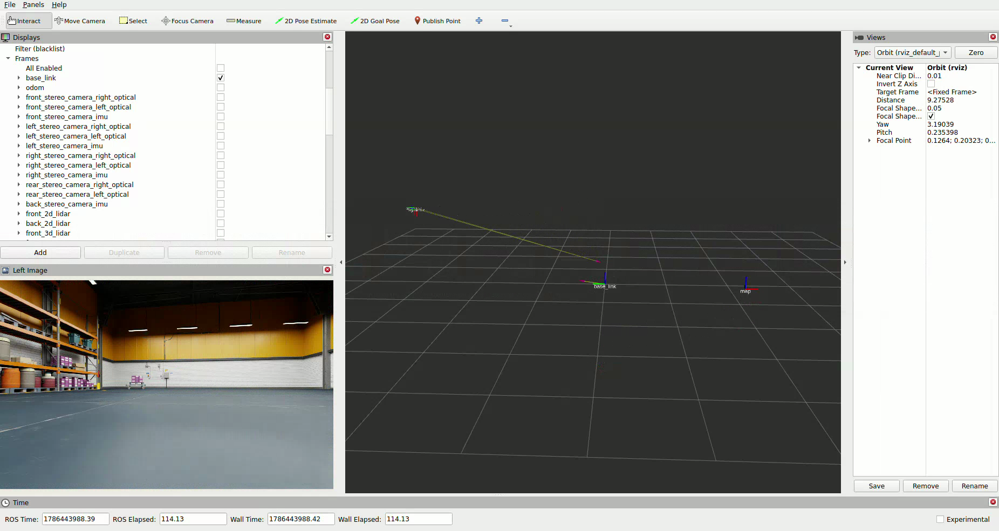

**Figure 5.** Representative RViz/TF visualization frame during mission execution.

Full recordings:

- [Mission execution demo](assets/mission_execution_demo.webm)
- [RViz execution demo](assets/rviz_execution_demo.webm)

---

# 4. AprilTag Performance Evaluation

## 4.1 Benchmark Objective

Functional validation and performance measurement were treated as separate tasks.

- **Function test:** Does Isaac Sim + RViz + AprilTag / Mission Client work correctly?
- **Node benchmark:** How much throughput can the AprilTag Node achieve when unrelated GPU workloads are removed?

The benchmark was first executed while other workloads such as Isaac Sim were active.

The same benchmark was then repeated after background GPU workloads were stopped, creating a cleaner benchmark condition.

## 4.2 Loaded vs Clean Benchmark

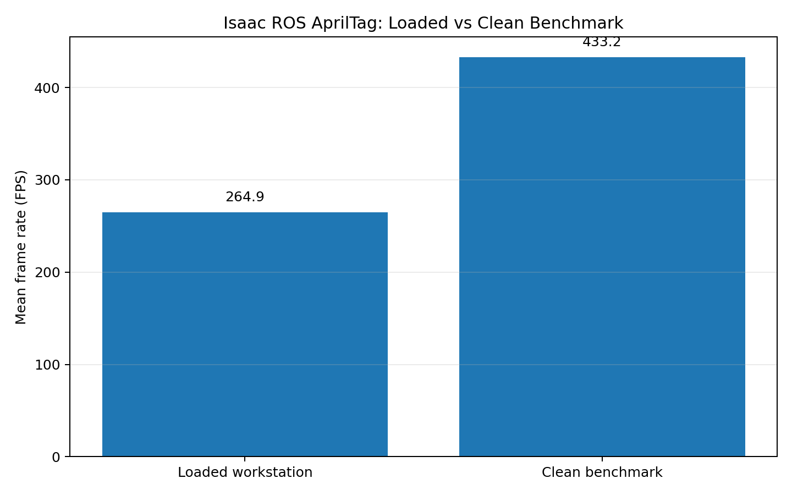

| Metric | Loaded workstation | Clean benchmark |
|---|---:|---:|
| Mean Frame Rate | 264.922 FPS | **433.187 FPS** |
| Mean Playback Rate | 268.331 FPS | **443.390 FPS** |
| Peak Throughput Prediction | 268.125 Hz | **443.281 Hz** |
| Idle GPU Utilization | 38.0% | **0.0%** |
| Idle System CPU Utilization | 9.208% | **0.344%** |

The Mean Frame Rate of the clean benchmark increased by approximately **63.5%** compared with the loaded workstation condition.

## 4.3 Real-Time Input Tracking

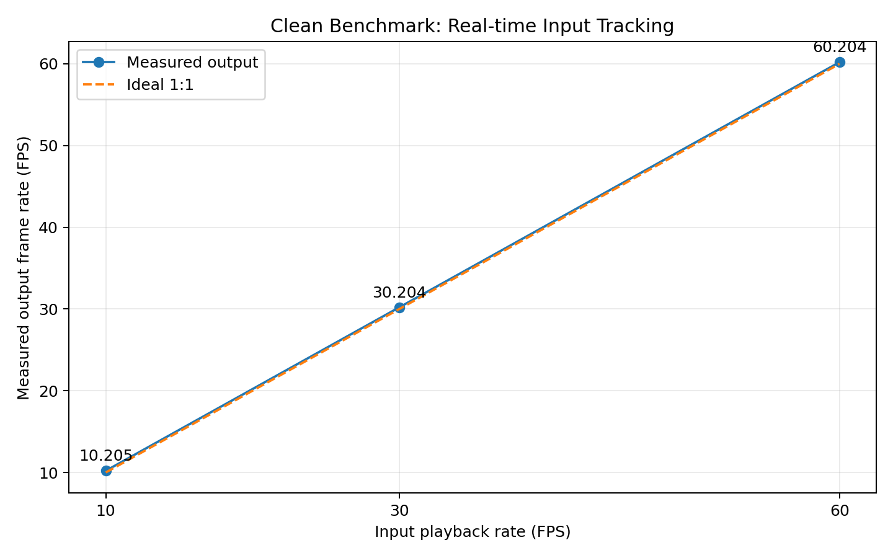

| Input | Measured Output | Missed Frames | First Latency | Last Latency |
|---:|---:|---:|---:|---:|
| 10 FPS | 10.205 FPS | 0 | 2.333 ms | 1.977 ms |
| 30 FPS | 30.204 FPS | 0 | 1.774 ms | 1.451 ms |
| 60 FPS | 60.204 FPS | 0 | 1.700 ms | 1.677 ms |

All 10 / 30 / 60 FPS test conditions recorded **0 missed frames**.

## 4.4 Clean Benchmark Final Result

```text
Resolution                  : HD (1280 x 720)
Mean Playback Frame Rate    : 443.390 FPS
Mean Frame Rate             : 433.187 FPS
Peak Throughput Prediction  : 443.281 Hz
Idle GPU Utilization        : 0.000 %
```

The benchmark report confirmed that the actual benchmark test completed successfully.

```text
Ran 1 test
OK
```

After the final report and report export were completed, additional `SIGTERM` / `SIGKILL` messages appeared while `component_container_mt` was being shut down.

These messages occurred during the **container cleanup stage after the benchmark result had already been generated**.

Raw benchmark logs:

- [Loaded workstation benchmark log](results/apriltag_benchmark_loaded_workstation.txt)
- [Clean benchmark log](results/apriltag_benchmark_clean.txt)
- [Benchmark summary JSON](results/benchmark_summary.json)
- [Benchmark summary CSV](results/benchmark_summary.csv)

---

# 5. What I Learned

## Isaac ROS and ROS 2

```text
ROS 2
= Node / Topic / Service / Action / DDS

Isaac ROS
= NVIDIA-optimized robotics packages running on top of ROS 2
```

Isaac ROS does not replace ROS 2.

Instead, it optimizes GPU-suitable workloads such as perception, AI, and sensor processing for NVIDIA platforms.

## Isaac Sim and Isaac ROS

```text
Isaac Sim
= Robot / Sensor / Physics Simulation

Isaac ROS
= Sensor Processing / Robotics Algorithms / Integration
```

## Difference Between the Two Examples

```text
AprilTag
Camera → GPU Perception → Detection / Pose

Mission Client
External Mission → MQTT / VDA5050 → Nav2 → Robot Action
```

---

# 6. Troubleshooting Notes

## When the AprilTag Image Does Not Appear in RViz

```bash
ros2 topic info -v /front_stereo_camera/left/image_rect_color
```

If the result shows:

```text
Publisher count: 0
```

check the Isaac Sim camera render product and ROS Camera Publisher before focusing on RViz QoS settings.

## When the Mission Client Reports a Missing `map` TF

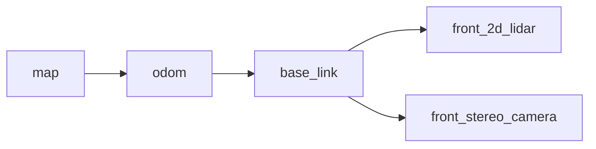

If the following error appears:

```text
Timed out waiting for transform from base_link to map
```

check the localization, odometry, TF, and LiDAR input states.

---

# 7. Repository Structure

```text
.
├── isaac_ros_RTX5090_AprilTag_n_MissionClient.md
├── isaac_ros_RTX5090_AprilTag_n_MissionClient_EN.md
├── assets/
│   ├── apriltag_sim_scene.png
│   ├── apriltag_rviz_detection.png
│   ├── apriltag_cuda_runtime.png
│   ├── mission_dispatch_api.png
│   ├── mission_before_after.png
│   ├── mission_rviz_execution_frame.png
│   ├── mission_execution_demo.webm
│   ├── rviz_execution_demo.webm
│   ├── benchmark_loaded_vs_clean.png
│   └── benchmark_realtime_fps.png
└── results/
    ├── apriltag_benchmark_loaded_workstation.txt
    ├── apriltag_benchmark_clean.txt
    ├── benchmark_summary.json
    └── benchmark_summary.csv
```

---

# 8. Future Work

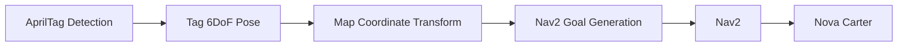

A future extension could detect a specific AprilTag and automatically navigate the robot to a predefined distance in front of the tag based on the detected pose.

---

# 9. Summary

**GPU Perception**

```text
Camera → Isaac ROS AprilTag → cuAprilTag → Tag ID / 6DoF Pose
```

**Mission / Robot Integration**

```text
Mission Dispatch → MQTT / VDA5050 → Isaac ROS Mission Client → Nav2 → Nova Carter
```

The AprilTag benchmark also demonstrated that benchmark results can vary significantly on the same hardware depending on whether unrelated background workloads are active.
